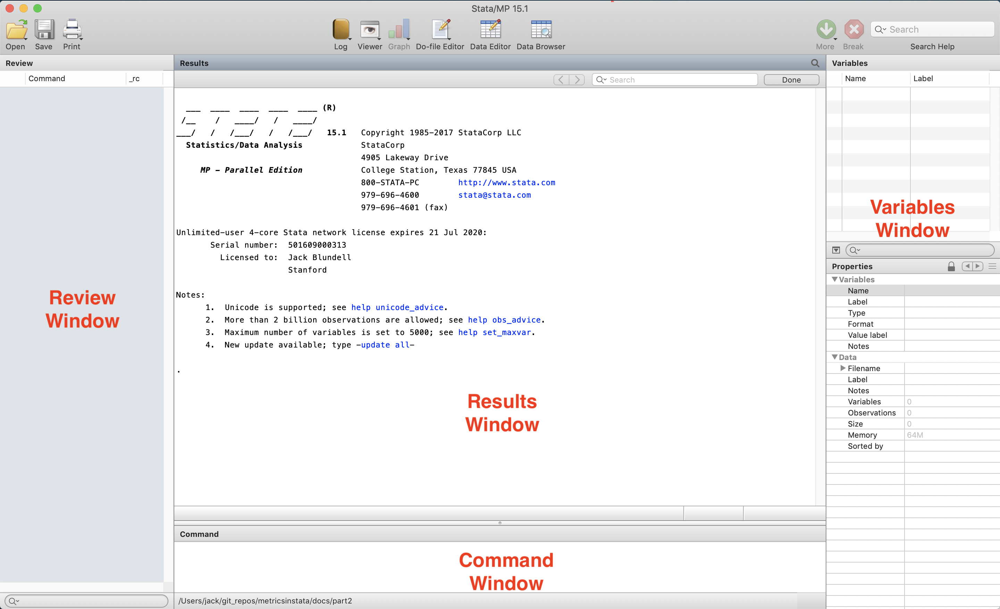
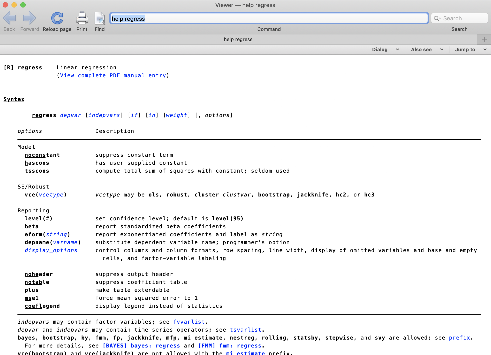
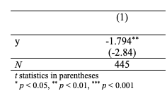

% Lecture 1: Introduction to Stata
% Jack Blundell (Stanford)
% PUBLPOL 330D Applied Econometrics for Public Policy, Winter 2020

+ My email: jackblundell@stanford.edu

+ My office hours: 8.30 - 10.30am every Thursday at Econ 350 (Landau building)

# 1. Introduction

In this class we will learn the basics of Stata. We will first go through some preliminaries, then launch into a simple worked example demonstrating how to:

1. Load data into Stata
2. Perform basic data-cleaning commands
3. Generate plots
4. Test for a difference in means between groups
5. Save your output in a convenient format

# 2. Getting started with Stata

Stata is a statistical package which is:

+ Highly optimized for common econometric methods, both in syntax and computation

+ Easy to use 

+ Well-supported by an active user base

+ Commonly installed in secure data labs

Stata is not:

+ As flexible as R and Python (Good luck applying machine learning in Stata!...)

+ As widely used in the private sector as it is in academia and think tanks

While R and Python are also valuable to learn, Stata remains the most-common programming language in empirical economics and is an excellent tool for learning and applying econometric methods. The majority of papers in applied economics include analysis using Stata and the majority of applied economists are comfortable using it.

## 2.1 The Stata Interface

The Stata Interface consists of the following windows:

{width=100%}

The roles of each element are:

+ The **command window** is where you can type in commands instructing Stata to perform calculations

+ The **results window** shows the output from any commands you run

+ The **review window** gives previous commands. This lets you keep track of what you've asked Stata to do.

+ The **variables window** gives information about variables. Note that each variable has a name and a label, along with some other properties

+ The **graph window** contains any graphical output

+ The **do-file editor** allows you to edit .do files, which is what Stata scripts are called. .do files contain commands which can then be run in batches. 

## 2.2 Running code in Stata

There are two ways to run code in Stata:

+ Typing directly into the command window then pressing enter

+ Writing then running a .do file

While the first option is easy for one-off commands, as you become familiar with the software it is best to use .do files. .do files are opened in the do-file editor, which can be opened through File -> New. They are run either by clicking 'do' or by pressing CMD+SHIFT+d (OSX) or CTRL+d (Windows). 

## 2.3 Finding help

Perhaps the most important Stata command to know is `help`, which brings up Stata documentation. For example, typing `help regress` into the command window then hitting enter will bring up all documentation on the `regress` command in Stata:

{width=100%}

See the end of these notes for further resources.

# 3. Worked example: Lalonde (1986)


Our application will be a classic paper in Labor economics (*LaLonde, Robert J. “Evaluating the Econometric Evaluations of Training Programs with Experimental Data.” The American Economic Review, 1986*). In this paper, LaLonde investigates the impact of a randomized employment program on earnings. The data is provided in `lalonde_experimental.txt`.


## 3.1 Starting a .do file

We can now start looking at an example .do file. A typical project consists of several (often several dozen) .do files each with hundreds of lines of code which are interlinked, but here we will just work from a single file.

A .do file should start with a title and short description. My .do file for example starts with the following:


{{1}}


{{2}}


The `/*` and `*/` symbols tell Stata that the enclosed text is not to be read as Stata commands, but instead provides information and context to the researcher reading the code. It is good practice when writing code to include some non-command text. These might be section titles, or small annotations describing code. Any text following `*` or `//`, or enclosed between `/*` and `*/` will not be read as a command by stata so can be used to convey this information. Here's an example of a comment, followed by a line of code:

```
// regress earnings on treatment for adult sub-sample
reg y t if age >= 18
```

While your code might seem self-explanatory to you at first, oftentimes this is not the case for others, a grader or indeed for your future self. To avoid clutter, I exclude all comments in the code included below, but you'll see them in the full .do file.

Next up in my .do file is the following:


{{3}}


{{4}}


These two commands (`clear` and `set more off`) are standard to include at the top of .do files. They clear the system and allow Stata to print large amounts of output to the screen. 

Next I set the working directory. For this example, we will work in a single folder which will be our directory, though more complex projects will require further structure. This should be where your .do file is saved, and where the data file `lalonde_experiment.txt` is saved. Unless otherwise specified, any output you generate will be saved here. 


{{5}}


The following two commands relate to log files. A log is a record of your code and the output your code generates. While it is possible for small projects to run all your code each time and simply inspect the results in the Stata results window, for longer projects it is useful to have a record of all your output. First I close any existing log file:


{{6}}


*Note that in this tutorial log commands are commented out using `//`. This is because the markdown with which this document is created does not function well with logs.*

 The code above will close any existing log file you have open, so that a new one can be opened. The `capture` command here is useful but we will not go into detail of how it works quite yet.

The next command starts a new log:


{{7}}


The command tells stata to `log` (create a log file containing results) and to save the file (`using`) as `lecture1log`. Any results generated will now end up in a `.smcl` log file in the main working directory. The `replace` option which follows will crop up several times in this example attached to numerous commands. It tells Stata to overwrite any existing file as required. Excluding `replace` will result in an error message if an overwrite is attempted.


## 3.2 Importing data

We first inspect the data file `lalonde_experiment.txt`. Opening this up in a text editor we see something like:

```
    1.0000    9.9300
    1.0000    3.5959
    1.0000   24.9094
    1.0000    7.5061
    1.0000    0.2898
    1.0000    4.0565
    1.0000         0
    1.0000    8.4722
    1.0000    2.1640
    1.0000   12.4181
    1.0000    8.1739
    1.0000   17.0946
    1.0000         0
    1.0000   18.7399
    1.0000    3.0239
```

There are two columns, each corresponding to a variable. The first column is a binary indicator telling us whether an individual received training (1) or not (0). The second column is the earnings of each individual after training. To get this into Stata we can use Stata's `import delimited` command. Note that the data file has to be in your current working directory for the below code to work.


{{8}}


We first give the command `import delimited` directed towards the file name `"lalonde_experiment.txt"`. There then follows a comma, after which we provide options as required. This is the standard structure of a Stata command. Remember you can always use `help` if unsure of the exact structure for a particular command.

This particular data import is complicated by the fact that the data file we are reading from is not in a standard format. Typically, the data is divided by a delimiter such as a comma, which enables easy reading of data into various formats. Here, the data is fixed-width, so we need to add the `delimiter(" ", collapse)` option. This is a good example of why it is worth inspecting the raw data before importing it.

*Note that command `insheet` is designed to import data of this type, but is far less common than `import delimited` so I've opted to demonstrate the latter*

To see what the data looks like now it is in Stata, typing the command `browse` into the command window brings up the data in a familiar spreadsheet-style format:

{width=100%}

## 3.3 Cleaning data

### 3.3.1 Variable names, labels and types

We have loaded our data, but it doesn't look particularly tidy. For a start, there are three variables whereas the true data only has two. We can see that variable `v1` is empty, so we can go ahead and drop this:


{{9}}


The remaining variables can then be renamed something more useful.


{{10}}


The training variable is named `t` for 'treatment', as is customary in the policy evaluation literature. The outcome variable (earnings) is named `y`. We can assign labels to give more information:


{{11}}


We can take a look at our cleaned-up variable names and labels using `describe`:


{{12}}


This also shows us that we have 446 observations and two variables.

The output produced above however shows that we have a problem with our data. The `storage type` column tells us the format in which Stata is storing each variable. Looking at the `storage type` column, we see that `y` is a `float` and `t` is a `str6`. We know that both variables are actually numeric, and their data types should reflect this. 

`float` is a data type used for continuous numeric data, which is appropriate for `y`. Abbreviation `str6` means that `t` has been imported as a string variable, which is a data type used for text information rather than numbers. To perform any analysis, this must first be converted to a numeric type:


{{13}}


`destring` achieves this, converting `t` to a numeric storage type. Option `replace` tells Stata to replace the existing variable rather than creating a new one. `force` tells Stata to convert any non-numeric entrys to missing values.

Lets check this has worked:


{{14}}


We can see that both variables are now stored as numbers. `t` is now a `byte`, which is an integer data type.

You may have noticed that rather than typing `describe`, the above code snippet achieves the same outcome with `des`. This is a feature of Stata. Commands (and variables) can be abbreviated. In the rest of the code below, I will use full command names when first using a command, then follow standard abbreviations if the command comes up again.

### 3.3.2 Missing data

A crucial part of cleaning data is investigating missingness. Here I generate a new variable using `generate` which tells us whether an individual is missing data on outcome variable `y`.


{{15}}


The first line of the above generates a variable which equals 0 for all observations. The second line is more complex. It is our first `if` statement. With this command we are telling Stata to replace the variable `missing_y` with the value 1 if variable `y` is missing for that individual. Stata requires two `=` signs for tests of equality. In Stata, missing data for numeric variables is coded as '.'.

We can now use `tabulate` to check how many individuals are missing `y`:


{{16}}


We see that there is only one observation missing y. Inspection of the original data reveals this to simply be a trailing row in the data set. We can drop this observation using the following command:


{{17}}


Repeated the above exercise for `t` shows that there are no further missing values for that variable.

### 3.3.3 Saving a cleaned dataset

With that basic data cleaning complete, we now save a cleaned version. This allows us to perform analysis without having to go through all the previous steps again. Data-cleaning code can often take a very long time to run, so its useful to "check-in" your dataset after cleaning.


{{18}}


Note that the dataset is saved as a '.dta', Stata's data file type. This type of file can be quickly read into Stata, with all variable names, labels and types maintained. The cleaned data will be saved into the current working directory.

## 3.4 Exploring data

We start by loading the cleaned dataset:


{{19}}


Stata command `summarize` is very useful for giving basic information about numerical variables:


{{20}}


We can see that mean earnings are $5,300. More detail can be requested by adding the `detail` option:


{{21}}


Clear from the percentiles provided by the detailed summary is that there are a large number of individuals with zero earnings. The 25th percentile is 0, so more than a quarter of individuals have no earnings.

For categorical variables such as `t`, `tabulate` can be used to give counts and shares:


{{22}}


We see that there are 260 individuals in the treatment group (`t=1`) and 185 in the control group (`t=0`).

## 3.5 Plotting data

With continuous data, it is usually a good idea to inspect a histogram before performing analysis. This can reveal any anomalies in the data and helps guide the choice of model. 

The first line of the code below generates a histogram. The `width(1)` option specifies that each 'bin' is of width 1. The second line exports the graph as a .png image of width 500.


{{23}}


{width=100%}

The distribution plotted here looks reasonable for earnings, given what studies have found using different datasets. There are a large number of individuals with zero earnings and a few high-earning outliers.

## 3.6 Do earnings differ between the treatment and control groups?

Finally, we would like to test whether earnings differ between the treatment and control groups. Assuming treatment is randomly assigned, this will give us an estimate of an average effect of training on earnings.

Before any formal statistical tests, we might first like to examine how earnings vary across groups. This can be achieved by `summarize` combined with an `if` statement:


{{24}}


We see that average earnings for those without treatment (`t=0`) are lower than those with treatment (`t=1`). Lets inspect this graphically by using a box plot:


{{25}}


{width=70%}

It looks like earnings are higher for those who received treatment (on the right), but is this difference statistically significant? We can test this by using a t-test. To test for equality of means between the treatment and control groups, we use the `ttest` command:


{{26}}


This command produces a large amount of information. The crucial section for us is at the bottom of the returned output. The p-value for our null hypothesis that the means of the two groups are equal is 0.0048, as given by `Pr(|T| > |t|)`.

Under the assumptions of the test, the patterns in the data which we see are then highly unlikely given the null hypothesis. Therefore we conclude that there is a statistically significant difference (at the 1% level) in earnings between the treatment and control groups. We estimate that the treatment increased earnings by $1,794, the difference in means between the two groups.

Finally, we would like to extract our results in a convenient format to be used in an article, report or academic paper. Tools for doing so are found in the `estout` package. Unlike all other commands used so far, estout is not a standard bundled Stata package but rather one which has been created by a user. This means that we must install it using `ssc install estout`. This only needs to be run once. User-produced packages such as this are very useful for filling gaps in the main set of Stata commands. 

Now that `estout` is installed, we can produce a nice-looking output of our t-test in a word doc, csv or latex format. The following code produces the results in a file which can be opened in Microsoft Word.


{{27}}


The first line of the above stores the values of `ttest y, by(t)`, the code run previously. The second formats and exports them to the specified destination. We can then view them as a tidy table in Word:

{width=50%}

The very final thing to do is to close the log file:


{{28}}


# 4. Further resources

There exist a large number of comprehensive Stata resources available:

+ User discussions at https://www.stata.com/statalist tackle many common problems

+ Princeton's introductory Stata course: https://data.princeton.edu/stata

+ Harvard's introductory Stata course: https://tutorials.iq.harvard.edu/Stata/StataIntro/StataIntro.html

+ Stata's own manual is verbose but useful: https://www.stata.com/manuals/gsm.pdf

+ Cheatsheets can be very handy. If working a lot in Stata, its nice to have some printed copies of these next to your desk: https://geocenter.github.io/StataTraining/portfolio/01_resource/

+ For those that want to learn more about how to structure large-scale social science projects and best coding practice, the definitive guide is Gentzkow and Shapiro (2014). This is particularly useful for those working as Research Assistants. It is found here: https://web.stanford.edu/~gentzkow/research/CodeAndData.pdf
